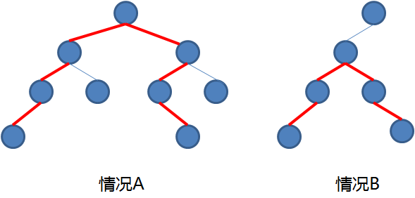

# 二叉树节点间的最大距离

计算一个二叉树的最大距离考虑两种情况：

- 情况1：根节点左子树上的最大距离或者根节点右子树上的最大距离
- 情况2：根节点左子树到root.left的最大距离 + 1 + 根节点右子树到root.right的最大距离





因为遍历node节点时候，需要知道node左子树和右子树的信息，所以使用后序遍历来解题。

```java
public class MaxDistance {
	// record用来记录从叶节点到node节点之前的最大路径
	// 这条路径的每个节点，只能有左子树或者右子树
	// 使用maxFromLeft和maxFromRight分别表示
	private static int record;
	
	/** 
	 *	curNodeMax包含当前节点
	 *	而lMax和rMax不包含当前节点
	 */
	public static int maxDistance(TreeNode root) {
		if (root == null) {
			record = 0;
			return 0;
		}
		int lMax = maxDistance(root.left);
		int maxFromLeft = record;
		
		int rMax = maxDistance(root.right);
		int maxFromRight = record;
		
		int curNodeMax = maxFromLeft + maxFromRight + 1;
		record = Math.max(maxFromLeft, maxFromRight) + 1;
		
		return Math.max(Math.max(lMax, rMax), curNodeMax);
	}
}
```