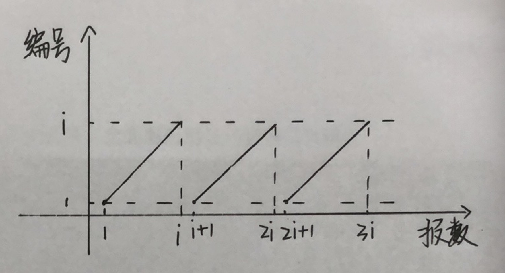
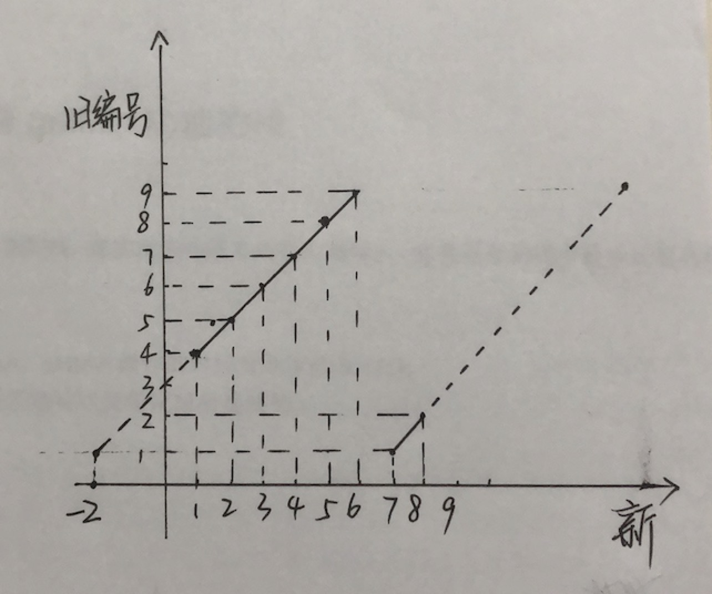

# 约瑟夫环问题（LeetCode ）


已知n个人（以编号1，2，3...n分别表示）围坐在一张圆桌周围。从编号为1的人开始报数，数到m的那个人出列；他的下一个人又从1开始报数，数到m的那个人又出列；依此规律重复下去，直到圆桌周围的人全部出列。要求输出最后一位出列的人的序号。那么这里主要研究的是最后一个出列的人的序号要怎么确定。


```
剩下1个人 最后存活的人编号为1
剩下2个人 最后存活的人编号为?
			.
			.
			.
剩下i个人 最后存活的人编号为?
			.
			.
			.
全部n个人 最后存活的人编号为?

找到一个公式f，从最后存活的编号中，
递推求到在所有存活的人中，最后活下来的人的初始编号。
```

#### 首先找到编号和报数之间的关系，编号会循环，而报数是一直增加的

| 编号        | 报数   |
| --------   | -----  | 
| 1          |  2  |
| 2 | 2 |
| ... | ... |
| i | i |
| 1 | i+1 | 
| 2 | i + 2| 
| ... | ... |
| 1| 2i + 1 |
| ... | ... |





```
如上可发现，编号和报数之间的关系为：
编号 = (报数-1) % i + 1
```


#### 接下找新编号和旧编号之间的关系

```java
假设杀死编号3

旧编号: 1 2 3 4 5 6 7 8 9
新编号: 7 8 x 1 2 3 4 5 6
```




```
如上可发现，旧编号和新编号之间的关系为：
旧编号 = (新编号 - (1 - s)) % i + 1
      = (新编号 + s - 1) % i + 1
其中，
	s = (m - 1) % i + 1
s为编号, m为报数
```

#### 化简最终结果

```
旧编号 = (新编号 + s - 1) % i + 1
      = (新编号 + (m - 1) % i + 1 - 1) % i + 1
      = (新编号 + (m - 1) % i) % i + 1

假设 m-1 = k*i + rest
那么,
旧编号 = (新编号 + rest) % i + 1
	==> 相似于
旧编号 = (新编号 + m - 1) % i + 1
```

最后得到的结论是:

**旧编号 = (新编号 + m - 1) % i + 1**

#### 例题

每年六一儿童节,牛客都会准备一些小礼物去看望孤儿院的小朋友,今年亦是如此。HF作为牛客的资深元老,自然也准备了一些小游戏。其中,有个游戏是这样的:首先,让小朋友们围成一个大圈。然后,他随机指定一个数m,让编号为0的小朋友开始报数。每次喊到m-1的那个小朋友要出列唱首歌,然后可以在礼品箱中任意的挑选礼物,并且不再回到圈中,从他的下一个小朋友开始,继续0...m-1报数....这样下去....直到剩下最后一个小朋友,可以不用表演,并且拿到牛客名贵的“名侦探柯南”典藏版(名额有限哦!!^_^)。请你试着想下,哪个小朋友会得到这份礼品呢？(注：小朋友的编号是从0到n-1)

```java
public class Solution {
    public int LastRemaining_Solution(int n, int m) {
        if (n <= 0) {
            return -1;
        }
        int last = getAlive(n, m);
        return last - 1;
    }
    
    public int getAlive(int n, int m) {
        if (n == 1) {
            return 1;
        }
        return (getAlive(n-1, m) + m - 1) % n + 1;
    }
}
```